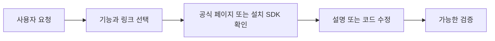

# AGIBOT X2 Ultra 인터페이스 스킬

**한국어** · [English](README.md) · [AI용 설치·사용 안내](INSTALL_FOR_AGENTS.md)

Codex, Claude Code, Cursor에서 AGIBOT X2 Ultra의 AimDK/ROS 2 인터페이스를 학습하고 C++·Python 코드를 수정하거나 자체 알고리즘을 개발할 때 쓰는 공통 스킬입니다. 요청에 필요한 공식 문서와 예제를 선택한 뒤 설명하거나 코드를 작성합니다.

버전 **1.1.0**은 제조사 문서 사본을 공식 링크로 대체한 공개판입니다. 설치·무결성 검사·링크 검색은 오프라인에서 가능합니다. 정확한 메시지 필드, 토픽 계약, 관절 범위와 센서 사양은 해당 공식 페이지 또는 설치된 SDK에서 확인합니다. 기체 기준은 **X2 Ultra Edition**이며 실행 경로를 확인한 모션 없는 장치 조회는 허용하고 모션 실행은 제외합니다.

**AI 설치 안내:** 설치·업데이트 요청에는 [INSTALL_FOR_AGENTS.md](INSTALL_FOR_AGENTS.md)를 읽고 실제 설치, 가능한 검사, 첫 사용 안내까지 수행하세요. 저장소 링크를 읽는 것만으로 환경 변경을 요청받은 것은 아닙니다.

공개 저장소: [https://github.com/dosigner/agibot-x2-skill](https://github.com/dosigner/agibot-x2-skill). 아래 스킬 ZIP을 받거나 저장소를 clone할 수 있습니다. Release 자산은 [Releases 페이지](https://github.com/dosigner/agibot-x2-skill/releases)에서 확인합니다.

## 다운로드

[스킬 ZIP](dist/agibot-x2-interfaces.zip) · [SHA-256](dist/agibot-x2-interfaces.zip.sha256) · [버전 표시 ZIP](dist/agibot-x2-interfaces-1.1.0.zip)

스킬 ZIP에는 자체 검증기가 포함된 `agibot-x2-interfaces/` 폴더 하나가 들어 있습니다. 전체 소스 패키지나 저장소 clone에는 `tools/install_skill.py`, 테스트와 안내 문서도 있습니다. GitHub가 자동 생성하는 “Source code” 압축파일은 소스 폴더이며 스킬 ZIP과 다릅니다.

## AI에게 설치 맡기기

스킬을 사용할 프로젝트를 열고, 대괄호를 실제 게시된 저장소 주소로 바꿔 요청하세요.

```text
이 저장소의 AGIBOT X2 스킬을 현재 도구와 프로젝트에 설치하고, 설치 확인 후 사용법과 첫 요청 예시를 알려줘: https://github.com/dosigner/agibot-x2-skill
```

AI가 저장소와 로컬 파일 실행 기능에 접근할 수 있어야 합니다. 기본은 현재 프로젝트 설치입니다. 모든 프로젝트에서 쓰는 개인 설치는 별도로 요청합니다. 샌드박스가 스킬 폴더 쓰기를 막으면 AI는 설치 미완료와 직접 실행할 터미널 명령을 안내해야 하며, 샌드박스 설정을 바꾸지 않습니다.

## 직접 설치하기

Python 3.10 이상이 필요하며 추가 Python 패키지는 사용하지 않습니다. 아래 명령은 Linux/macOS 셸 문법입니다. 실행 검증은 Linux에서 수행했으며 Windows/macOS는 미실시입니다.

```bash
git clone https://github.com/dosigner/agibot-x2-skill.git
cd agibot-x2-skill
```

소스 폴더의 루트에서 도구를 선택하고 프로젝트 경로를 바꿔 실행합니다.

```bash
python3 tools/install_skill.py --client codex --project "/absolute/path/to/project"
```

Claude Code는 `--client claude`, Cursor는 `--client cursor`로 바꿉니다. 설치 위치만 보려면 `--dry-run`을 추가합니다. 개인 설치를 선택했다면 `--project ...` 대신 `--user`를 사용합니다. 같은 내용은 재사용하며 다른 기존 내용은 보존하고 중단합니다. 업데이트하려면 `--backup-existing`을 사용할 수 있습니다. 기존 폴더는 스킬 검색 경로 밖인 `.agibot-x2-backups/<client>/...`에 남깁니다.

스킬 ZIP만 받았다면 ZIP과 체크섬을 같은 폴더에 놓고 실행합니다.

```bash
sha256sum -c agibot-x2-interfaces.zip.sha256 &&
python3 -m zipfile -e agibot-x2-interfaces.zip x2-unpacked &&
python3 x2-unpacked/agibot-x2-interfaces/scripts/verify.py --expected-version 1.1.0
```

macOS에서는 체크섬 명령을 `shasum -a 256 -c`로 바꿉니다. 체크섬이 OK이고 검증기가 `passed: true`일 때 폴더 전체를 아래 경로로 옮기세요. 같은 폴더가 이미 있으면 보존하고 소스 설치기로 업데이트합니다. 스킬 ZIP에는 `tools/install_skill.py`가 없습니다.

| 도구 | 프로젝트 기준 경로 | 개인 경로 | 호출 |
|---|---|---|---|
| Codex | `.agents/skills/agibot-x2-interfaces/` | `~/.agents/skills/agibot-x2-interfaces/` | `$agibot-x2-interfaces` |
| Claude Code | `.claude/skills/agibot-x2-interfaces/` | `~/.claude/skills/agibot-x2-interfaces/` | `/agibot-x2-interfaces` |
| Cursor | `.cursor/skills/agibot-x2-interfaces/` | `~/.cursor/skills/agibot-x2-interfaces/` | `/agibot-x2-interfaces` 선택 |

Cursor는 공통 경로도 발견하므로 설치기가 같은 범위의 `.agents` 또는 `.claude` 사본을 재사용할 수 있습니다. 발견 결과가 불명확하면 프로젝트·개인 범위의 기존 사본을 확인합니다. [호환성 안내](docs/COMPATIBILITY.md)에 공식 근거를 연결했습니다.

## 확인과 첫 요청

Codex 프로젝트 설치 예입니다.

```bash
python3 .agents/skills/agibot-x2-interfaces/scripts/verify.py --expected-version 1.1.0
python3 .agents/skills/agibot-x2-interfaces/scripts/lookup.py --feature 4.1 --sensor rgbd --language python
```

다른 도구에서는 실제 `.claude` 또는 `.cursor` 경로를 사용합니다. 조회 결과에는 기능 `4.1`, `contracts_included: false`, RGB-D 공식 링크가 나옵니다. 복제한 엔드포인트 정의는 반환하지 않습니다. `--type TouchState`도 공식 문서 링크를 반환합니다. 파일·링크 조회 검사와 클라이언트의 실제 발견은 다르므로 필요하면 새 세션을 열어 호출하세요.

```text
$agibot-x2-interfaces AGIBOT X2 Ultra의 RGB-D 데이터 흐름을 설명해줘. 연결된 공식 문서를 읽고 확인된 계약과 일반 ROS 개념을 구분해줘. 로봇에는 접근하지 마.
```

Claude Code와 Cursor에서는 `/agibot-x2-interfaces`로 시작합니다. 스킬 이름 뒤에 다음처럼 요청할 수도 있습니다.

| 목적 | 예시 |
|---|---|
| 학습 | RGB-D 영상과 CameraInfo의 관계, 설치 SDK에서 확인할 내용을 설명해줘. |
| 기존 코드 수정 | camera_listener.py에 프레임 저장을 추가해줘. 기존 언어·확정 조건은 유지하고 구현을 바꾸는 미확인 결정만 질문해줘. |
| 자체 알고리즘 | 입력·시간·좌표계·실패 처리가 명시된 C++ 카메라·IMU 추정기를 설계해줘. |



스킬 본문과 안내는 주로 한국어입니다. 필요한 경우 영어 답변을 요청할 수 있습니다. 공식 사이트에 접근하지 못하면 확인하지 못한 계약을 밝히고, 근거가 있는 작업을 계속합니다.

## 범위와 검증

5개 모듈, 23개 기능, 36개 공식 예제 묶음, 93개 타입 이름의 공식 링크를 제공합니다. 제조사 메시지 정의 원문, 엔드포인트 표, 원문 HTML, 관절·FOV 사양표와 이전 원문 포함 ZIP은 제외했습니다. URL과 짧은 이름은 탐색 정보이며 외부 페이지에는 해당 출처의 조건이 적용됩니다.

이번 검사와 모델 평가 결과는 [검증 보고서](docs/VALIDATION.md)에 기록합니다. 이전 1.0.1의 결과를 1.1.0의 모든 동작에 대한 검증으로 사용하지 않습니다. Cursor GUI·모델 호출과 실장비 검증은 미실시입니다. ROS 빌드, 센서 수신, 모션은 스킬 설치와 별개의 검사입니다.

## 라이선스

직접 작성한 코드·설명에는 AGIBOT 공식 X2 URDF 저장소에서도 사용하는 [Mulan PSL v2](LICENSE)를 적용했습니다. 이것이 AimDK 웹 문서에도 같은 라이선스가 적용된다는 뜻은 아닙니다. 해당 웹 문서에서 “All Rights Reserved”를 확인했고 추출물 재배포 허가는 확인하지 못했으므로, 공개판은 원문 대신 공식 링크를 제공합니다. [제3자 자료 고지와 출처](THIRD_PARTY_NOTICES.md)를 참고하세요.

유지보수 검사는 `python3 tools/check_release.py`, `python3 -m unittest discover -s tests -p 'test_*.py' -v`입니다. [유지보수·게시 안내](docs/MAINTAINING.md)에 공개 파일 선별 절차가 있습니다.
