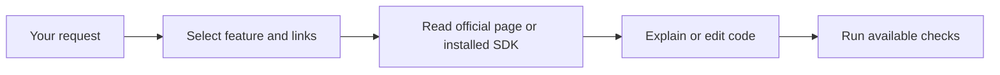

# AGIBOT X2 Ultra interface skill

[한국어](README.ko.md) · **English** · [For AI agents: install and introduce this skill](INSTALL_FOR_AGENTS.md)

A shared skill for Codex, Claude Code and Cursor. It helps you learn AGIBOT X2 Ultra AimDK/ROS 2 interfaces, edit C++ or Python code and develop your own algorithms. It selects the relevant official documentation and examples before working on your request.

Version **1.1.0** uses official links in place of manufacturer document copies. Installation, integrity checks and link selection work offline. Exact message fields, topic contracts, joint limits and sensor specifications require access to the selected official page or the installed SDK. The robot reference remains **X2 Ultra Edition**; non-motion device queries are permitted after execution-path inspection, and motion execution is excluded.

**AI agents:** For an installation/update request, follow [INSTALL_FOR_AGENTS.md](INSTALL_FOR_AGENTS.md). Install, verify what is possible, and finish with first-use guidance. Reading a repository link alone does not request changes to the environment.

Public repository: [https://github.com/dosigner/agibot-x2-skill](https://github.com/dosigner/agibot-x2-skill). Download the included skill ZIP below or clone the repository. Release assets are listed on the [Releases page](https://github.com/dosigner/agibot-x2-skill/releases).

## Download

[Skill ZIP](dist/agibot-x2-interfaces.zip) · [SHA-256](dist/agibot-x2-interfaces.zip.sha256) · [Versioned ZIP](dist/agibot-x2-interfaces-1.1.0.zip)

The skill ZIP contains one `agibot-x2-interfaces/` folder with a verifier. The full source package or repository clone also contains `tools/install_skill.py`, tests and these guides. GitHub's generated “Source code” archive is a source checkout, not the same file as the skill ZIP.

## Ask your AI to install

Open the target project and send this request with the actual published repository URL:

```text
Install this repository's AGIBOT X2 skill in my current tool and project, verify it, then show me how to use it and give me a first request: https://github.com/dosigner/agibot-x2-skill
```

Local file execution and repository access are required. The default scope is your current project. Request personal scope explicitly if you want it in all projects. When the client sandbox protects its skill directory, the agent must report incomplete installation and give you the exact terminal command; it must preserve sandbox settings.

## Install yourself

Use Python 3.10+; no extra Python packages are needed. Shell examples use Linux/macOS syntax. Current runtime validation is on Linux; Windows/macOS have not been run.

```bash
git clone https://github.com/dosigner/agibot-x2-skill.git
cd agibot-x2-skill
```

From the source checkout root, choose a client and replace the target path:

```bash
python3 tools/install_skill.py --client codex --project "/absolute/path/to/project"
```

Choose `--client claude` or `--client cursor` for those tools. Add `--dry-run` to preview the path. Replace `--project ...` with `--user` only for a chosen personal installation. Identical contents are reused. Different existing content is preserved and the command stops; an intended update can use `--backup-existing`, which saves the old folder under `.agibot-x2-backups/<client>/...` outside skill discovery.

For a skill ZIP download, put the ZIP and checksum together and run:

```bash
sha256sum -c agibot-x2-interfaces.zip.sha256 &&
python3 -m zipfile -e agibot-x2-interfaces.zip x2-unpacked &&
python3 x2-unpacked/agibot-x2-interfaces/scripts/verify.py --expected-version 1.1.0
```

On macOS use `shasum -a 256 -c` for the checksum. Continue only if it is OK and the verifier reports `passed: true`. Move the complete extracted skill folder into one destination below. Preserve an existing folder and use the source installer for an update. The skill ZIP contains no `tools/install_skill.py`.

| Client | Project destination | Personal destination | Invocation |
|---|---|---|---|
| Codex | `.agents/skills/agibot-x2-interfaces/` | `~/.agents/skills/agibot-x2-interfaces/` | `$agibot-x2-interfaces` |
| Claude Code | `.claude/skills/agibot-x2-interfaces/` | `~/.claude/skills/agibot-x2-interfaces/` | `/agibot-x2-interfaces` |
| Cursor | `.cursor/skills/agibot-x2-interfaces/` | `~/.cursor/skills/agibot-x2-interfaces/` | Select `/agibot-x2-interfaces` |

Cursor also discovers shared paths; the installer reuses an identical `.agents` or `.claude` copy in the selected scope. Check existing project and personal copies if discovery is ambiguous. See [compatibility](docs/COMPATIBILITY.md).

## Verify and make a first request

For a Codex project installation:

```bash
python3 .agents/skills/agibot-x2-interfaces/scripts/verify.py --expected-version 1.1.0
python3 .agents/skills/agibot-x2-interfaces/scripts/lookup.py --feature 4.1 --sensor rgbd --language python
```

Use the actual `.claude`/`.cursor` path for other clients. The lookup should return feature `4.1`, `contracts_included: false` and official RGB-D links. It does not return copied endpoint definitions. `--type TouchState` likewise returns documentation links. These results verify files and link selection; client discovery requires a separate invocation, possibly in a new session.

```text
$agibot-x2-interfaces Explain the AGIBOT X2 Ultra RGB-D data flow. Read the linked official documentation and distinguish confirmed contracts from general ROS concepts. Do not access a robot.
```

Use `/agibot-x2-interfaces` for Claude Code or Cursor. Other requests after the skill name:

| Goal | Example |
|---|---|
| Learn | Explain how RGB-D images and CameraInfo relate. Identify what needs checking in the installed SDK. |
| Edit existing code | Add frame saving to camera_listener.py. Retain its language and established requirements; ask only about decisions affecting implementation. |
| Develop an algorithm | Design a C++ camera/IMU estimator with explicit inputs, timestamps, coordinate frames and failure handling. |



The skill body and routing notes are mainly Korean; request an English answer if needed. If the official site is unavailable, the agent must identify missing contracts and continue only with work supported by available evidence.

## Coverage and validation

The package routes 5 modules, 23 features, 36 official example groups and 93 type names. Manufacturer message definitions, endpoint tables, raw HTML, joint/FOV specification tables and the previous full-reference ZIPs are excluded. URLs and short labels are navigation metadata; third-party pages keep their own terms.

See the [validation report](docs/VALIDATION.md) for current tests and model probes. Earlier 1.0.1 results are not claims about every 1.1.0 behavior. Cursor GUI/model invocation and live robot verification remain untested. Build, sensor reception and motion are separate from installing a skill.

## License

Original project code and writing are licensed under [Mulan PSL v2](LICENSE), also used by AGIBOT's official X2 URDF repository. This choice does not apply that repository's license to the AimDK website. We found an “All Rights Reserved” notice there and did not establish permission to redistribute its document extracts, so this release links to those pages instead. See [third-party notices and sources](THIRD_PARTY_NOTICES.md).

Maintainers can run `python3 tools/check_release.py` and `python3 -m unittest discover -s tests -p 'test_*.py' -v`. [Maintenance and publication steps](docs/MAINTAINING.md) include the allowlisted export process.
